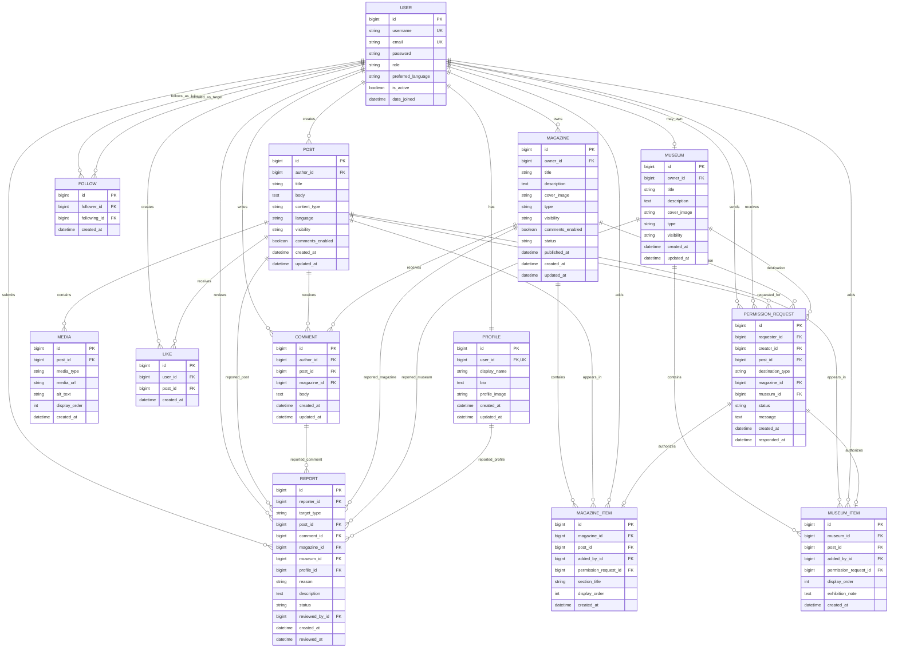

# Literary Museum — Database ER Diagram

**Document Version:** 0.1  
**Status:** In Progress

---

## 1. Purpose

This document visualizes the current relational database design for the Literary Museum project.

The diagram is based on the entities and relationships defined in:

```text
docs/database-design.md
```

The schema is still under review and may change before Django model implementation begins.

---

## 2. Entity Relationship Diagram



---

## 3. Cardinality Notes

The diagram uses the following Mermaid cardinality notation:

| Symbol | Meaning |
|---|---|
| `||` | Exactly one |
| `o|` | Zero or one |
| `o{` | Zero or many |
| `|{` | One or many |

Examples:

```text
USER ||--|| PROFILE
```

means:

```text
One User has exactly one Profile.
```

```text
USER ||--o{ POST
```

means:

```text
One User may create zero or many Posts.
```

```text
USER ||--o| MUSEUM
```

means:

```text
One User may own zero or one Personal Museum.
```

---

## 4. Constraints Not Fully Represented in the Diagram

Some business rules cannot be represented completely through the visual relationship lines.

They must be enforced through Django validation, database constraints, or application permissions.

### Follow

The pair below must be unique:

```text
(follower_id, following_id)
```

A User cannot follow themselves.

### Like

The pair below must be unique:

```text
(user_id, post_id)
```

A User may like the same Post only once.

### Comment

A Comment must reference exactly one supported target:

```text
Post
or
Magazine
```

It must not reference both or neither.

### MagazineItem

The pair below should normally be unique:

```text
(magazine_id, post_id)
```

Another creator's Post requires an accepted PermissionRequest.

### Museum

A User may own at most one Personal Museum.

Creating a Personal Museum is optional.

### MuseumItem

The pair below should normally be unique:

```text
(museum_id, post_id)
```

Another creator's Post requires an accepted PermissionRequest.

### PermissionRequest

A request must reference exactly one destination:

```text
Magazine
or
Museum
```

Permission is valid only for the specified Post and destination.

### Report

A Report must reference exactly one reportable target:

```text
Post
Comment
Magazine
Museum
Profile
```

---

## 5. Open Design Decisions

The following decisions remain open:

- Behavior when a creator deletes their account
- Preservation of works in historical publications
- Behavior after permission revocation
- Permission revocation for already-published official magazines
- Exact database constraints for conditional uniqueness
- Exact deletion behavior for related records
- Whether Comment targets should remain nullable foreign keys or use separate comment models
- Whether Report targets should remain nullable foreign keys or use a more general moderation-target model

These decisions must be finalized before Django migrations are created.

---

## 6. Diagram Status

Current diagram progress:

- [x] User
- [x] Profile
- [x] Post
- [x] Media
- [x] Follow
- [x] Like
- [x] Comment
- [x] Magazine
- [x] MagazineItem
- [x] Museum
- [x] MuseumItem
- [x] PermissionRequest
- [x] Report
- [ ] Relationship validation
- [ ] Constraint validation
- [ ] Deletion strategy
- [ ] Final ER diagram review
